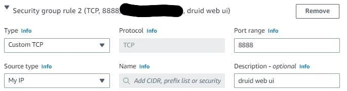
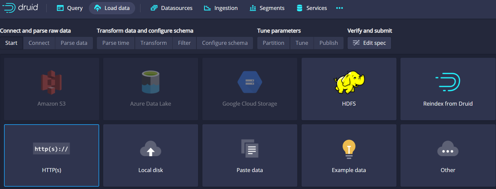

# druid insallation

### Resources
To ensure sufficient resources for Druid, it is recommended to install it on an AWS EC2 instance of type t2.medium. This instance type, which runs Amazon Linux and offers 2 vCPUs and 4GB of memory, provides more resources compared to t2.micro, which is part of the AWS free tier.


for more details: https://druid.apache.org/docs/latest/operations/single-server.html

### security rule:
allow 8888 port for druid web ui


**The software requirements for the installation machine are:**
* Java 8u92+ or Java 11
```bash
sudo yum install java-11
```
* Python 3 (preferred) or Python 2 : already installed
* Perl 5 : already installed
```bash
sudo yum install perl
```

## installations:

environments variables:
```export JAVA_HOME=```

install Druid
```bash
wget https://dlcdn.apache.org/druid/26.0.0/apache-druid-26.0.0-bin.tar.gz
tar -xzf apache-druid-26.0.0-bin.tar.gz
cd apache-druid-26.0.0

# run druid only nano (because of the resources)
./bin/start-nano-quickstart &
```

## problems:

problem 1: can't process parquet file format
install extensions: druid-parquet-extensions
Requires druid-avro-extensions to be loaded.

https://druid.apache.org/docs/latest/development/extensions.html
https://druid.apache.org/docs/latest/development/extensions-core/parquet.html

```bash
vim apache-druid-26.0.0/conf/druid/single-server/nano-quickstart/_common/common.runtime.properties
```

add to the list of extensions

```druid.extensions.loadList=["druid-avro-extensions", "druid-parquet-extensions"]```

## Work with Druid
### load data from parquet file sources:
[top-reviews.parquet
](https://github.com/ofirshmuel/druid-insallation/raw/main/top-reviews.parquet)

[funniest_recommendation.parquet
](https://github.com/ofirshmuel/druid-insallation/raw/main/funniest_recommendation.parquet)

step 1: load the data from the source



transform data, configure schema, partition data to segments and tune the data.

test the data with the example sql

### monitor data, ingestions, tasks and logs:
For general logs and druid commponents: ```apache-druid-26.0.0/logs```

For indexing tasks logs: ```var/druid/indexing-logs```

examples for successful indexing logs in `logs` folder
